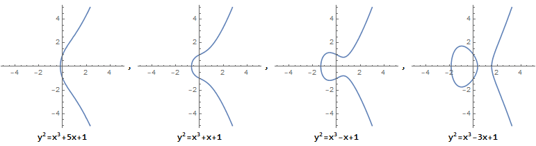

# Basic Elliptic
## Introduction
In this article, I will introduce some basic operations of an elliptic in an intuitive way. Elliptic can be used to make homomorphic encryption. Besides homomorphic addition and scalar multiplication, which also can be implemented by exponential operations on large prime numbers, elliptic is able to support [homomorphic multiplication](./zk%20SNARK.md#prepare) between two encrypted objects.  
### Defination
A complete defination of an elliptic is as follows:  
$$y^2 + axy + by = x^3 + cx^2 + dx + e$$  
In crypto, an elliptic curve might simply be the set of points described by the equation:  
$$y^2 = x^3 + ax + b$$  
where $4a^3+27b^2\neq 0$, or there might be singularity on a curve. The equation above is what is called *Weierstrass normal form* for elliptic curves. The picture of the curves may be as follows:  
  

#### Addition
The principle of the addition operation defined on elliptic curves, can be intuitively understood as "shotting", is illustrated as follows (it will be computed by taking the modulus and transforming it into a finite field; here, for intuitive understanding, it is sufficient to consider only the operation on real curves):  
  
The elliptic curve addition operation defines the "sum" of three points on the curve as 0 if they are on a line, i.e., in the figure above, $A+B+C'=0$. A point symmetric to the x-axis is its "negative" point, i.e., the point symmetric to $B$ on the x-axis in the figure above is $-B$. Since the elliptic curve is symmetric about the x-axis, each point on the curve corresponds to a "negative" point on the curve, e.g., -C'=C in the figure above.

#### Scalar Multiplication 
We explained the operation $A+B$ above, and an arbitrary scalar multiplication starts from that $A$ and $B$ is at the same point. In this case, it is actually the tangent line through A.  
  
The example in the picture above is how to calculate $4\cdot a$. We can add 4 times as above picture shows. And more efficiently, we can calculate $a+a$ to get $2a$ and then calculate $2a + 2a$ to get $4a$.

### Example
A typic example is simple signature based on addition and acalar multiplication operations of a elliptic. More details can be found [here](https://en.wikipedia.org/wiki/Elliptic_Curve_Digital_Signature_Algorithm).

## Mathematicals
### Algebraic
This [article](https://andrea.corbellini.name/2015/05/17/elliptic-curve-cryptography-a-gentle-introduction/) provides an intuitive and detailed explanation of how basic operations(addition and scalar multiplication) on an elliptic work algebraically.  

### Addition
Simply, only consider two non-zero, non-symmetric points $P = (x_P, y_P)$ and $Q = (x_Q, y_Q)$.  
* In case $x_P \neq x_Q$:  
$$m = \frac{y_P - y_Q}{x_P - x_Q}$$  
$m$ is the slope of $line_{PQ}$.  
Then:  
$$
\begin{align*}
    x_R & = m^2 - x_P - x_Q \\
    y_R & = y_P + m(x_R - x_P)
\end{align*}
$$  
Hence:  
$$(x_P, y_P) + (x_Q, y_Q) = (x_R, -y_R)$$  

* In case $P == Q$, the slope of $line_{PQ}$ is:  
$$m = \frac{3 x_P^2 + a}{2 y_P}$$  
and the rest parts are the same.   

### Scalar Multiplication
Scalar multiplication can be treated as continuous addition operations,   
$$nP = \underbrace{P + P + \cdots + P}_{n\ \text{times}}$$  
but there is more efficient ways, the core point of which is expressing n as binary:  
$$n=\underbrace{2^{k-1}\cdot i_{k-1}+2^{k-2}\cdot{i_{k-2}}+2^{k-3}\cdot{i_{k-3}}+...+2^{1}\cdot{i_{1}}+2^{0}\cdot{i_{0}}}_{k\ \text{times}}$$  
where  
$$i_{l}=0\ \text{or}\ 1,\ l\in \{0, 1, ..., k-1,k\}$$  
So $nP$ can be expressed as:  
$$nP=\underbrace{2^{k-1}\cdot i_{k-1}P+2^{k-2}\cdot{i_{k-2}}P+2^{k-3}\cdot{i_{k-3}}P+...+2^{1}\cdot{i_{1}}P+2^{0}\cdot{i_{0}}P}_{k\ \text{times}}$$  
$P, 2\cdot P, 4\cdot P, ..., 2^{k}\cdot P$ can be calculated one by one. 

### Finite Fields
This [article](https://andrea.corbellini.name/2015/05/23/elliptic-curve-cryptography-finite-fields-and-discrete-logarithms/) provides how basic operations(addition and scalar multiplication) on an elliptic work in **finite fields** in detail.  

Actually, the calculation in finite fields is quite similiar. 
### Addition
We have:  
$$
\begin{align*}
  x_R & = (m^2 - x_P - x_Q) \bmod{p} \\
  y_R & = [y_P + m(x_R - x_P)] \bmod{p} \\
      & = [y_Q + m(x_R - x_Q)] \bmod{p}
\end{align*}
$$  
In case $P\neq Q$:  
$$m = (y_P - y_Q)(x_P - x_Q)^{-1} \bmod{p}$$  
In case $P == Q$:  
$$m = (3 x_P^2 + a)(2 y_P)^{-1} \bmod{p}$$  

### Scalar Multiplication
Almost the same as algebraic except that calculation is based on `mode` operation.
